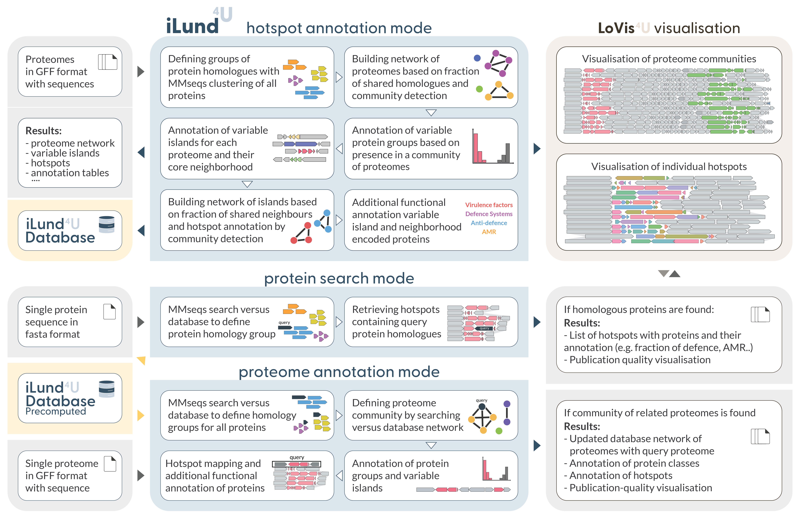
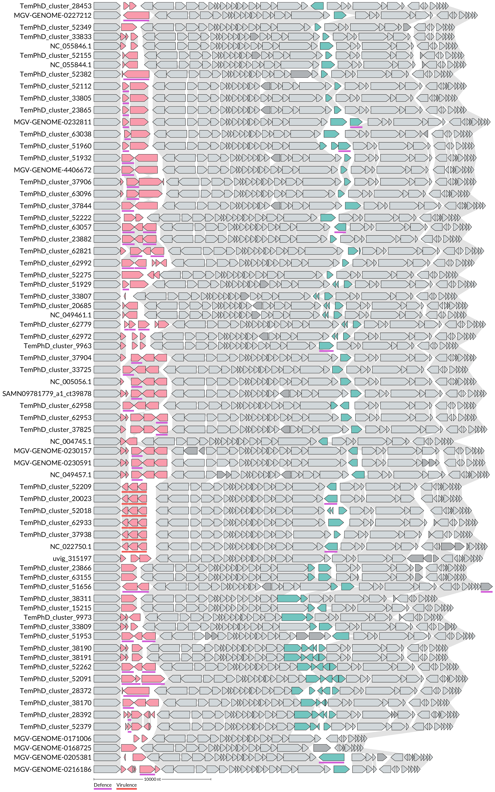
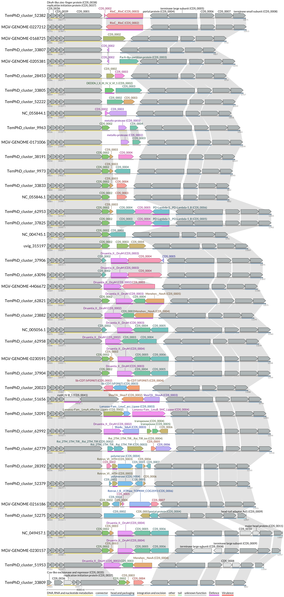
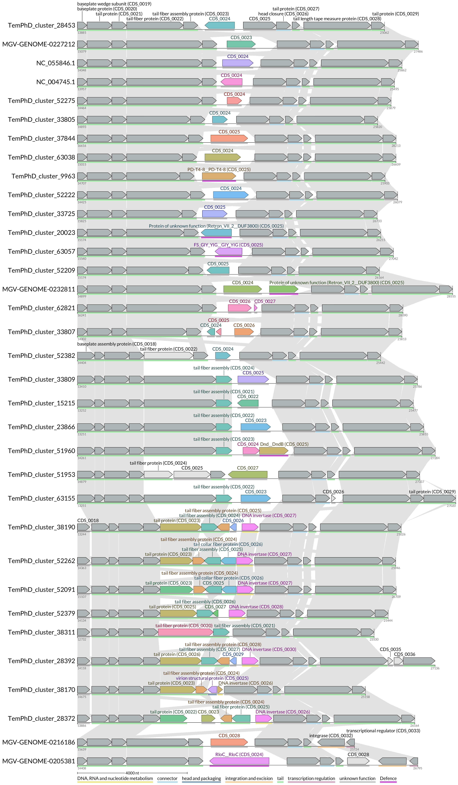
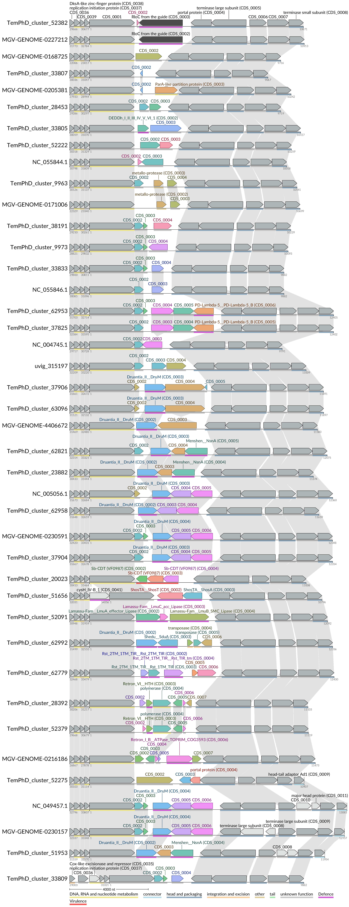
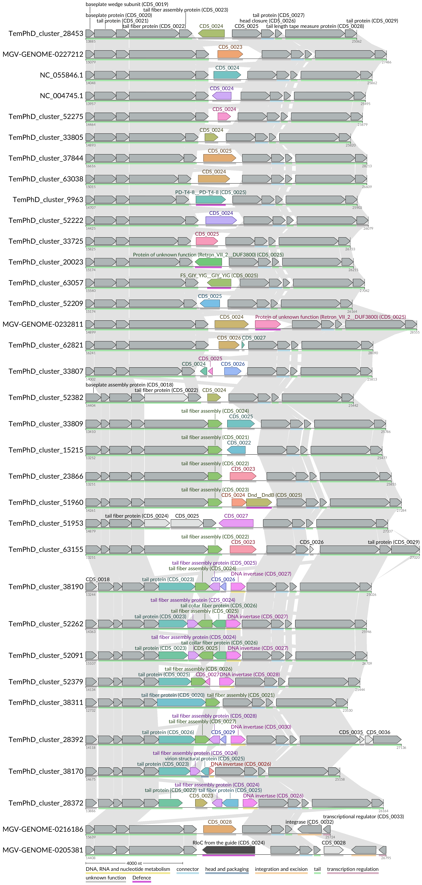
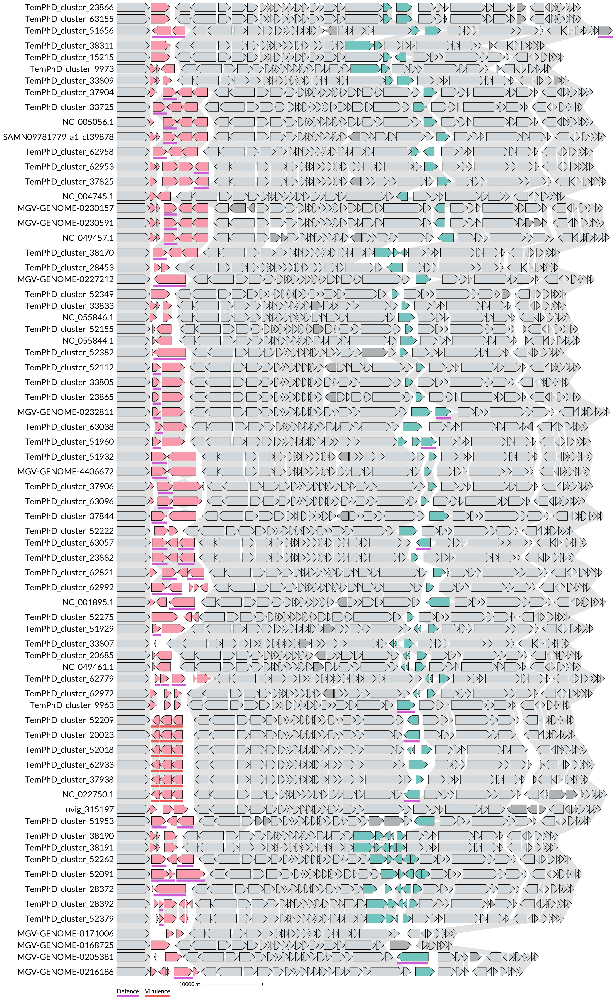
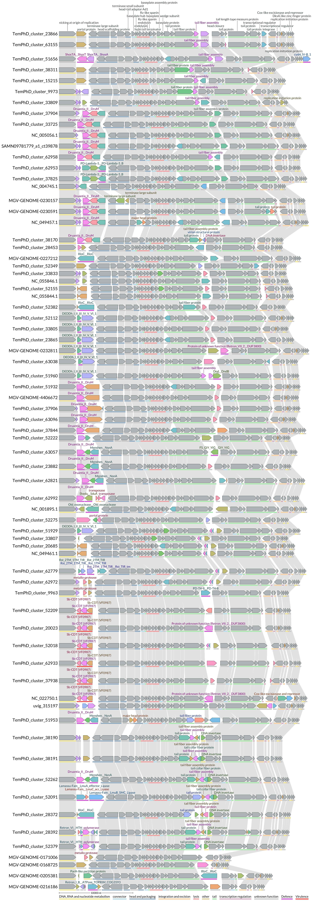
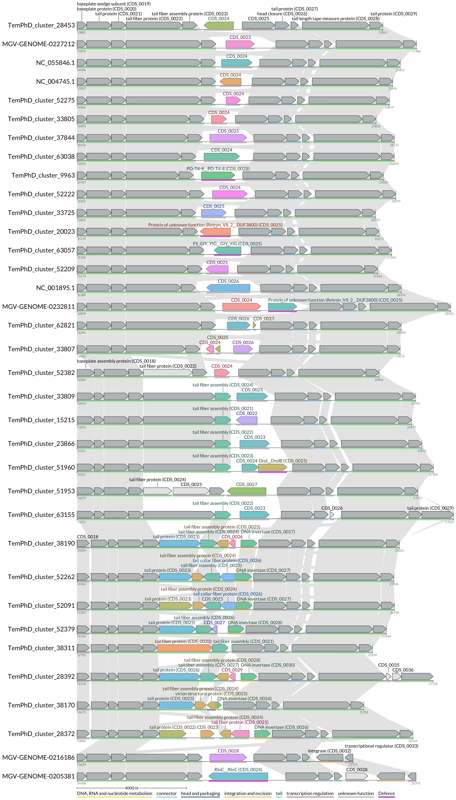
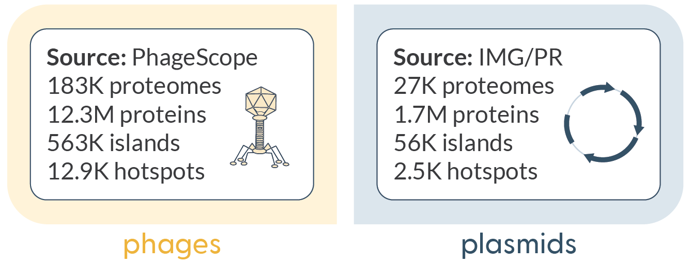

# Example-driven guide

Here we show usage examples of the iLund4u command-line interface. Through this guide we will show you step-by-step how to use our tool in three available modes: **hotspot annotation**, **protein search**, and **proteome annotation**.
 
## Before start

### Data preparation 

The necessary sample data as well as adjustable tool configuration files are provided by iLund4u at the post-install step:    
`ilund4u --data` which copies the folder *ilund4u_data* to your working directory. 
  
**If you work on a Linux machine** after installation you should run: `ilund4u --linux`  
This command replaces the tools paths (MMseqs2) in the pre-made config files from the MacOS (default) to the Linux versions.  
If you run this command for fun and want to change it back you can use `ilund4u --mac`.


**Downloading HMM models:** ilund4u uses pyhmmer for additional functional annotation of proteins with hmmscan versus a set of databases. You can download these database from our server ([data-sharing.atkinson-lab.com/iLund4u](https://data-sharing.atkinson-lab.com/iLund4u/)) by running `ilund4u --get-hmms` command. List of databases: AMR: AMRFinderPlus (v. 02.05.2024.2); Anti-defence: dbAPIS_Acr (v. 19.09.2023); Defence: DefenceFinder (v. 1.2.4), CasFinder (v. 3.1.0); Virulence: VFDB (v. 10.05.2024).

^^For this demonstration we will use pharokka-generated gff files with sequences of 70 P2-like phages.  
Gff files are stored at: *ilund4u_data/guide/gff_files*.^^      
The main difference of pharokka/prokka generated gff files from a regular gff3 (for ex. which you can download from the NCBI) is that in addition to annotation rows they contain the corresponding nucleotide sequence in fasta format. 

**Note:** Each gff file should contain a corresponding nucleotide sequence. iLund4u is designed to handle pharokka/prokka produced annotation files.  


### Help messages 

To show the main iLund4u help message you can use `ilund4u --help`.  
To show mode-specific help messages use: `ilund4u --help [mode]` (e.g. `ilund4u --help hotspots`)


### Building compatible gff files based on nucleotide sequences

If your query set of sequences for hotspot annotation contains only nucleotide fasta files, below we will provide the efficient way of using [pharokka](https://pharokka.readthedocs.io/en/latest/) (phage annotation pipeline) and [prokka](https://github.com/tseemann/prokka) (prokaryotic genome annotation pipeline) for preparing gff files compatible with iLund4u. 

#### Using pharokka for annotation of phage genomes

Before running pharokka you need to install pharokka databases (and pharokka itself, of course). Due to the number of non-python dependencies we recommend using a conda environment for this task. See [pharokka documentation page](https://pharokka.readthedocs.io/en/latest/install/) for clear instructions.

Firstly, if you have up to ~1000 nucleotide sequences we recommend merging them into one fasta file (could be done simply by using cat: `cat folder_with_fasta_files/*.fa > merged_fasta.fa`.  
We recommend to merge multiple sequences to one file and using meta mode since in that case we do not load databases for each contig while annotating. 
  
Then, you can use pharokka in meta mode with one command:  
```sh
pharokka.py -i merged_fasta.fa  -o pharokka_output  --meta --split -t Num_of_threads \
	--skip_mash --dnaapler  -database path_do_pharokka_database 
```

Gff files for each query contig will be stored at: *pharokka_output/single_gffs*


In case you have thousands of input sequences we recommend splitting them into several fasta files with ~1000 sequences in each. Then you can run pharokka on these sets of sequences. One of the ways to parallelise this process is shown below:
```sh
for f in folder_with_fasta/*.fa; do fb=$(basename $f); nm=${fb//.fa/}; \ 
	echo pharokka.py -i $f  -o pharokka_batches/$nm  --meta --split -t Num_of_threads \
	--skip_mash --dnaapler  --database bin/pharokka/databases ; \
	done | parallel -j Num_of_parallel_processes
```
Here you set Num_of_threads・Num_of_parallel_processes equal to the number threads you want to use.

Then you can move generated gff files to one folder using:
```sh
for f in pharokka_batches/*; do mv $f/single_gffs/* pharokka_gffs/; done
```


#### Using prokka for annotation of prokaryotic genomes

Prokka does not have an equivalent of meta mode which we used in pharokka in the example above. Therefore, for any number of input sequences we prefer running prokka independently for each contig instead of dividing more complex gff files, which requires an additional step. Again, for prokka installation instruction and parameter description see  [prokka documentation page](https://github.com/tseemann/prokka).

In case your input fasta query files (^^one sequence per file^^) are located in *single_records* folders you can run:
```sh
for f in single_records/*.fa;  do fb=$(basename $f); nm=${fb//.fa/}; \ 
	echo prokka --outdir prokka/$nm --prefix $nm --quiet --cpus 1 $f ; \
	done | parallel -j num_of_available_threads
```
Then you can move generated gff files to one folder using:
```sh
for f in prokka/*; do fb=$(basename $f); echo mv  $f/$fb.gff prokka_gffs/ ; done | parallel
```

## iLund4u workflow


<figure markdown="span" style="align:center; margin-top: 0; margin-bottom: 0;">
	{ width="100%" loading=lazy }  
	<figcaption style="margin-top: 0; margin-bottom: 0;">Figure 1. iLund4u workflow</figcaption>
</figure>


## Hotspot annotation mode

### Run with default parameters

Let's start with the main mode of iLund4u - hotspot annotation (see the workflow Figure 1).  
The only mandatory argument for this mode is a folder path containing compatible gff files.
```
ilund4u hotspots --gff ilund4u_data/guide/gff_files
```
With the first argument after ilund4u we specified the mode of usage `hotspots`.   

??? card_heart_cog "**Log messages for the example run with default parameters**" 
	```qwerty
	○ Reading gff files...
  	◉◉◉◉◉◉◉◉◉◉◉◉◉◉◉◉◉◉◉◉◉◉◉◉◉◉◉◉◉◉◉◉ 70/70
	○ Running mmseqs for protein clustering...
  	⦿ 166 clusters for 2847 proteins were found with mmseqs
  	⦿ mmseqs clustering results were saved to P2-like_phages_guide/mmseqs/mmseqs_clustering.tsv
	○ Processing mmseqs results ...
  	◉◉◉◉◉◉◉◉◉◉◉◉◉◉◉◉◉◉◉◉◉◉◉◉◉◉◉◉◉◉◉◉ 70/70
  	⦿ 0 proteomes were excluded after proteome deduplication and filtering
	○ Proteomes network construction...
  	◉◉◉◉◉◉◉◉◉◉◉◉◉◉◉◉◉◉◉◉◉◉◉◉◉◉◉◉◉◉◉◉ 70/70
  	⦿ Network building elapsed time: 0.03 sec
  	⦿ Proteomes network with 2413 connections was built
  	⦿ Network was saved as P2-like_phages_guide/proteome_network.gml
	○ Proteome network partitioning using the Leiden algorithm...
  	⦿ 1 proteome communities were found
  	⦿ 1 proteomes communities with size >= 10 were taken for further analysis
  	⦿ 0 proteomes from smaller communities were excluded from the analysis
	○ Defining protein classes within each community...
  	◉◉◉◉◉◉◉◉◉◉◉◉◉◉◉◉◉◉◉◉◉◉◉◉◉◉◉◉◉◉◉◉ 1/1
	○ Annotating variable islands within each proteome...
  	⦿ 176 variable regions are annotated in 70 proteomes (2.514 per proteome)
	○ Island network construction within each proteome community...
  	◉◉◉◉◉◉◉◉◉◉◉◉◉◉◉◉◉◉◉◉◉◉◉◉◉◉◉◉◉◉◉◉ 1/1
  	⦿ Island network building elapsed time: 0.09 sec
	○ Searching for hotspots within each community...
  	◉◉◉◉◉◉◉◉◉◉◉◉◉◉◉◉◉◉◉◉◉◉◉◉◉◉◉◉◉◉◉◉ 1/1
  	⦿ 2 hotspots were found in 1 proteome communities  (Avg: 2.0 per community)
	○ Preparing data for additional island protein annotation with pyhmmer hmmscan...
  	⦿ Running pyhmmer hmmscan versus DefenceFinder and CasFinder Databases...
    	◉◉◉◉◉◉◉◉◉◉◉◉◉◉◉◉◉◉◉◉◉◉◉◉◉◉◉◉◉◉◉◉ 143/143
    	Number of hits: 22
  	⦿ Running pyhmmer hmmscan versus Virulence Factor Database...
    	◉◉◉◉◉◉◉◉◉◉◉◉◉◉◉◉◉◉◉◉◉◉◉◉◉◉◉◉◉◉◉◉ 143/143
    	Number of hits: 3
  	⦿ Running pyhmmer hmmscan versus Anti-Prokaryotic Immune Systems Database (dbAPIS)...
    	◉◉◉◉◉◉◉◉◉◉◉◉◉◉◉◉◉◉◉◉◉◉◉◉◉◉◉◉◉◉◉◉ 143/143
    	Number of hits: 0
  	⦿ Running pyhmmer hmmscan versus AMRFinderPlus Database...
    	◉◉◉◉◉◉◉◉◉◉◉◉◉◉◉◉◉◉◉◉◉◉◉◉◉◉◉◉◉◉◉◉ 143/143
    	Number of hits: 0
	○ Hotspot network construction...
  	◉◉◉◉◉◉◉◉◉◉◉◉◉◉◉◉◉◉◉◉◉◉◉◉◉◉◉◉◉◉◉◉ 2/2
	○ Hotspot network partitioning using the Leiden algorithm...
	  ⦿  0 hotspots were merged to 0 not singleton communities
	○ Protein group statistics calculation...
	  ◉◉◉◉◉◉◉◉◉◉◉◉◉◉◉◉◉◉◉◉◉◉◉◉◉◉◉◉◉◉◉◉ 2/2
	○ Visualisation of hotspot communities using lovis4u...
 	 ◉◉◉◉◉◉◉◉◉◉◉◉◉◉◉◉◉◉◉◉◉◉◉◉◉◉◉◉◉◉◉◉ 2/2
	○ Visualisation of proteome communities with corresponding hotspots using lovis4u...
 	 ◉◉◉◉◉◉◉◉◉◉◉◉◉◉◉◉◉◉◉◉◉◉◉◉◉◉◉◉◉◉◉◉ 1/1
	```
	**Note:** you can use `-q`, `--quite` command-line argument to hide progress messages. 

By running this command, an output folder named ilund4u_{current_date} (e.g. ilund4u_2024_06_25-16_36) will be created.  
The name of the output folder can be changed with `-o <output_folder_name>`.  


??? card_hearts "**Output folder structure**" 

	- ***all_proteins.fa*** - fasta file with all proteins encoded by input genomes.
	- ***mmseqs*** - folder containing mmseqs clustering results.  
	- ***dropped_sequences.tsv*** - table containing information about dropped sequences during the deduplication process (in order not to analyse several sequences with identical sets of protein groups).
	- ***proteome_network.gml*** - proteome network in gml format.
	- ***proteome_communities.tsv*** - proteome communities and annotation based on proteome network partitioning using the Leiden algorithm.
	- ***protein_group_classes.tsv*** - annotation table for each protein group (set of homologous proteins defined by mmseqs clustering) with a group presence in a community of proteomes and corresponding class.
	- ***island_networks*** - folder containing networks of islands in gml format.
	- ***island_annotation.tsv*** - table with annotation of islands (regions of non-conserved proteins in each proteome) that then were merged to hotspots.
	- ***hotspot_annotation.tsv*** - annotation table of identified hotspots.
	- ***hotspot_network.gml*** - network of hotspots in gml format.
	- ***hotspot_communities.tsv*** - hotspot communities -we can expect that hotspots identified in different proteome communities could have the same flanking genes That is why we cluster together such hotspots. This file describes such communities.
	- ***hotspot_community_annotation.tsv*** - annotation table of identified hotspot communities.
	- ***protein_group_statistics.tsv*** - annotation table of protein groups identified as cargo in hotspots.
	- ***lovis4u_proteome_communities*** - folder with LoVis4u visualisation of proteome communities.
	- ***lovis4u_hotspots*** - folder with LoVis4u visualisation of each hotspot community.
	- ***lovis4u_hotspots_annotation*** - folder with LoVis4u annotation tables for hotspot visualisation.  


<figure markdown="span" style="float: right; margin: 0; padding: 0;">
	{align=right loading=lazy width="440" margin="0" padding="0"}  
	<figcaption style="margin: 0; padding: 0;">Figure 2</figcaption>
</figure>

In the example above we used 70 P2-like phages that are known to be in one community (group of related proteomes) based on our iLund4u hotspot annotation, run on all available phage sequences. As expected we find all guide sequences to be members of one community of proteomes with average proteome composition similarity (fraction of shared protein homologues) equal to 0.856 (see *proteome_communities.tsv* table and *proteome_network.gml* network files).


On the visualisation of full length sequences from the proteome community (Fig. 2) built with [LoVis4u](https://art-egorov.github.io/lovis4u/) we can see two annotated hotspots highlighted.  
The presence of hotspots in P2-like phages has previously been reported and it is known that the left-most (highlighted in red) hotspot contains diverse anti-phage defence cargo proteins  *(See [Rousset Francois, et al. Cell Host & Microbe, 2022](https://doi.org/10.1016/j.chom.2022.02.018))*.  
iLund4u indicates that some genomes contain virulence factors (cytolethal distending toxin (CDT) [VF0987]) in the same hotspot locus.

On the proteome community figure (Fig. 2) you can see that most of the differences in terms of protein composition between phages are concentrated in these two hotspots. However, there are also other variable regions with at least one non-conserved protein coding gene distributed across genomes, however, iLund4u does not merge these with other hotspots due to these regions lacking conserved flanking genes. Such genes are shown with in dark grey while conserved (or core) protein coding genes are light grey.

Below you can see LoVis4u visualisation of each hotspot loci - cargo proteins and up to 10 conserved flanking genes. 

??? card_figure_red "**LoVis4u visualisation of 0-0 hotspot** *(Figure 3)*" 
	
	{loading=lazy width="100%" }  


??? card_figure_blue "**LoVis4u visualisation of 0-1 hotspot** *(Figure 4)*" 

	{loading=lazy width="100%" }  

### Building the iLund4u database

As you can see in the workflow (Fig. 1), during hotspot annotation, iLund4u can also create a database that then can be used for two other modes: protein and proteome annotation.  
To create a database in addition to hotspot annotation you need to add the argument `-o-db <dir name>` or `--output-database <dir name>` with the specified database folder name. For example:
```sh
ilund4u hotspots --gff ilund4u_data/guide/gff_files -o P2-like_phages_guide  -o-db P2-like_phages_guide_DB
```
This database, which is built on a guide set of 70 P2-like phages annotation gff files, is also available in the ilundu4_data folder under the following path: *ilund4u_data/guide/like_phages_guide_DB*. 

### Specifying the circularity of sequences

Another important optional argument is  `-gct, --genome-circularity-table <path>` which takes path to a table containing information for each genome about whether it is circular or not. Format: tab-separated; column names: *id*, *circular*. Values 1 or 0. For genomes in which the id is not listed in this table, the default value will be 1 (circular) ; You can use -ncg/--non-circular-genomes to change the default value to 0 (non circular).  
This parameter is important since if the genome is circular then the first and last proteins will be considered as neighbours, which affects the flanking gene sets of proteins located near the ends of sequences. Since for these phages in the example we have circular genomes and this value is default, you can see that the breaks between the end and start of contigs are ignored for hotspot 0-0 (Fig. 3).  

---

## Protein annotation mode

### Run with default parameters

For the demonstration of protein annotation mode we took the protein [WP_171864480.1](https://www.ncbi.nlm.nih.gov/protein/WP_171864480.1/) , which  is annotated as E. coli RloC in the [Defense Finder database](https://defensefinder.mdmlab.fr/wiki/refseq). We chose RloC since it is an annotated cargo protein and is found on both of our annotated hotspots.  
Here we can also start with only the mandatory arguments set: `-fa <fasta_path>` - path to a fasta file with query protein amino acid sequence and `-db <db_path>` - path to iLund4u database folder. Again, optionally you can specify an output folder name using `-o <folder_name>` parameter.
```
ilund4u protein -fa  ilund4u_data/guide/RloC.fa -db ilund4u_data/guide/P2-like_phages_guide_DB -o RloC_search
```


??? card_heart_cog "**Log messages for the example run with default parameters**" 
	```qwerty
	○ Loading database from ilund4u_data/guide/P2-like_phages_guide_DB...
	○ Loading cds objects...
  	◉◉◉◉◉◉◉◉◉◉◉◉◉◉◉◉◉◉◉◉◉◉◉◉◉◉◉◉◉◉◉◉ 2847/2847
	○ Loading island objects...
  	◉◉◉◉◉◉◉◉◉◉◉◉◉◉◉◉◉◉◉◉◉◉◉◉◉◉◉◉◉◉◉◉ 176/176
	○ Loading proteome objects...
  	◉◉◉◉◉◉◉◉◉◉◉◉◉◉◉◉◉◉◉◉◉◉◉◉◉◉◉◉◉◉◉◉ 70/70
	○ Loading hotspot objects...
  	◉◉◉◉◉◉◉◉◉◉◉◉◉◉◉◉◉◉◉◉◉◉◉◉◉◉◉◉◉◉◉◉ 2/2
	⦿ The ilund4u_data/guide/P2-like_phages_guide_DB database was successfully loaded
	○ Running mmseqs for protein search versus the database of proteins...
  	⦿ A homologous group was found for 1/1 query protein
	○ Searching for hotspots with your query protein homologues...
  	⦿ Query protein homologues were found in 2 hotspot communities (2 hotspots) on 4 islands
    	Found as cargo: 4, as flanking gene: 0
	⦿ Homologous proteins were saved to RloC_search/homologous_proteins.fa and the MSA was visualised with MSA4u
	○ Visualisation of the hotspot(s) with your query protein homologues using lovis4u...
	⦿ Done!
	```

??? card_hearts "**Output folder structure**" 

	- ***mmseqs_homology_search_full.tsv*** - table with identified homologues.
	- ***mmseqs*** - folder containing mmseqs results and logs.  
	- ***homologous_proteins.fa*** - fasta file containing query protein and identified homologues.
	- ***homologous_proteins_aln.fa*** - alignment fasta file containing query protein and identified homologues built with MAFFT.
	- ***msa4u_homologous_proteines.pdf*** - MSA4u visualisation of the protein alignment.
	- ***found_island_annotation.tsv*** - annotation table of islands containing query protein homologues.
	- ***found_hotspot_annotation.tsv*** - annotation table of hotspots containing query protein homologues. 
	- ***lovis4u_full*** - folder containing LoVis4u visualisation of hotspots where query protein homologues are found.
	- ***lovis4u_with_query*** - folder containing LoVis4u visualisation of hotspots with only loci where query protein homologues are found.
	- ***lovis4u_hotspots_annotation*** - folder with LoVis4u annotation tables for hotspot visualisation.  


**Note:** iLund4u searches for homology not only versus cargo proteins but against flanking genes as well.

### Specifying homology search mode and setting up labels

Protein annotation mode has two important optional arguments that we want to describe here.  

The first one: `-hsm, --homology-search-mode <group|proteins>`  which specifies the mode of search for homologous proteins in the database. If "group" is selected, a query protein is assigned to the same homologous group as that of the best search hit protein. In "proteins" mode, all target proteins that pass the cutoffs are considered to be homologues. By default, "group" mode is set. We recommend to use "proteins" mode if you want to find more diverse set of homologues.  

Second important argument we want to highlight is `-ql, --query-label <str>` which simply changes the label of your query protein homologues on LoVis4u visualisation.  
For example:
```sh
ilund4u protein -fa  ilund4u_data/guide/RloC.fa -db ilund4u_data/guide/P2-like_phages_guide_DB \
	-o RloC_search -ql "RloC from the guide"
``` 
Below you can see visualisation of the same 0-0 and 0-1 hotspots with highlighted RloC proteins

??? card_figure_red "**LoVis4u visualisation of 0-0 hotspot with RloC** *(Figure 5)*" 
	
	{loading=lazy width="100%" }  


??? card_figure_blue "**LoVis4u visualisation of 0-1 hotspot with RloC** *(Figure 6)*" 

	{loading=lazy width="100%" }  

Additionally, iLund4u returns visualisation (on one figure) of all loci where only query protein homologues are found (Fig. 7):

<figure markdown="span" style="align:center; margin-top: 0; margin-bottom: 0;">
	{loading=lazy width="100%" }  
	<figcaption style="margin-top: 0; margin-bottom: 0;">Figure 7</figcaption>
</figure>

---

## Proteome annotation mode

### Run with default parameters

For demonstration of proteome annotation mode we took *Enterobacteria phage P2* [NC_001895.1](https://www.ncbi.nlm.nih.gov/nuccore/NC_001895.1/) that is also known to be a member of the community of listed test set of phages based on our analysis of all phages.  
In this mode mandatory arguments are `-gff <gff_path>` - path to gff file (again, pharokka/prokka annotated) of your query proteome and `-db <db_path>` - path to a database. Optionally you can specify output folder name using `-o <folder_name>` parameter.
```sh
ilund4u proteome -gff  ilund4u_data/guide/NC_001895.1.gff \
	-db ilund4u_data/guide/P2-like_phages_guide_DB -o NC_001895.1_search
```

??? card_heart_cog "**Log messages for the example run with default parameters**" 
	```qwerty
	○ Loading database from ilund4u_data/guide/P2-like_phages_guide_DB...
	○ Loading cds objects...
  	◉◉◉◉◉◉◉◉◉◉◉◉◉◉◉◉◉◉◉◉◉◉◉◉◉◉◉◉◉◉◉◉ 2847/2847
	○ Loading island objects...
  	◉◉◉◉◉◉◉◉◉◉◉◉◉◉◉◉◉◉◉◉◉◉◉◉◉◉◉◉◉◉◉◉ 176/176
	○ Loading proteome objects...
  	◉◉◉◉◉◉◉◉◉◉◉◉◉◉◉◉◉◉◉◉◉◉◉◉◉◉◉◉◉◉◉◉ 70/70
	○ Loading hotspot objects...
  	◉◉◉◉◉◉◉◉◉◉◉◉◉◉◉◉◉◉◉◉◉◉◉◉◉◉◉◉◉◉◉◉ 2/2
	⦿ The ilund4u_data/guide/P2-like_phages_guide_DB database was successfully loaded
	○ Reading gff file...
	○ Running mmseqs for protein search versus the database of proteins...
	  ⦿ A homologous group was found for 39/42 query proteins
	○ Searching for similar proteomes in the database network
	○ Preparing data for protein annotation with pyhmmer hmmscan...
	  ⦿ Running pyhmmer hmmscan versus DefenceFinder and CasFinder Databases...
	    ◉◉◉◉◉◉◉◉◉◉◉◉◉◉◉◉◉◉◉◉◉◉◉◉◉◉◉◉◉◉◉◉ 42/42
	    Number of hits: 1
	  ⦿ Running pyhmmer hmmscan versus Virulence Factor Database...
	    ◉◉◉◉◉◉◉◉◉◉◉◉◉◉◉◉◉◉◉◉◉◉◉◉◉◉◉◉◉◉◉◉ 42/42
	    Number of hits: 0
	  ⦿ Running pyhmmer hmmscan versus Anti-Prokaryotic Immune Systems Database (dbAPIS)...
    	◉◉◉◉◉◉◉◉◉◉◉◉◉◉◉◉◉◉◉◉◉◉◉◉◉◉◉◉◉◉◉◉ 42/42
    	Number of hits: 0
  	⦿ Running pyhmmer hmmscan versus AMRFinderPlus Database...
    	◉◉◉◉◉◉◉◉◉◉◉◉◉◉◉◉◉◉◉◉◉◉◉◉◉◉◉◉◉◉◉◉ 42/42
    	Number of hits: 0
	⦿ 70 similar proteomes were found in the database network with max proteome similarity = 0.92
	⦿ The query proteome was assigned to a community (id: 0) with connection to 1.0 of its members with avg weight = 0.86
	⦿ Protein class distribution in query proteome: 36 conserved, 5 variable, 1 intermediate
	⦿ 3 variable islands were annotated in the query proteome
	⦿ 2 of annotated variable islands were mapped to the database hotspots
	○ Lovis4u visualisation of communities and proteomes...
	○ Lovis4u visualisation found hotspots..
	⦿ Done!
	```
??? card_hearts "**Output folder structure**" 

	- ***all_proteins.fa*** - fasta file with query sequence proteins.
	- ***mmseqs*** - folder containing mmseqs results and logs.  
	- ***mmseqs_homology_search_full.tsv*** - table containing results of finding protein homologues for all proteins from the query proteome.
	- ***hmmscan*** - folder containing additional functional annotation of *all* query sequence proteins versus a set of databases with pyhmmer. 
	- ***query_proteome_network.tsv*** - sequence id and weights of all edges to the database network of proteomes.
	- ***similar_proteome_communities.tsv*** - table containing annotation of proteome communities with similar proteomes to your query.	- ***query_protein_clusters.tsv*** - annotation of query sequence protein classes - variable/intermediate/conserved depending on their presence in proteome community.
	- ***island_to_hotspot_mapping.tsv*** - mapping of variable islands (regions with at least one non-conserved proteins in your query sequence) that were annotation as hotspots in the database.
	- ***annotation_of_mapped_hotspots.tsv*** - annotation of mapped hotspots containing their description and statistics.
	- ***lovis4u_proteome_community_hotspots.pdf**** - LoVis4u visualisation of all members of proteome community with your query sequence where hotspots are highlighted.
	- ***lovis4u_proteome_community.pdf*** - LoVis4u visualisation of all members of proteome community with your query sequence where highlighted all non-conserved proteins (found in a small fraction of proteomes within the community).  
	- ***lovis4u_query_proteome_hotspot.pdf*** - LoVis4u visualisation of only query proteome with highlighted hotspots.
	- ***lovis4u_query_proteome_variable.pdf*** - LoVis4u visualisation of only query proteome with highlighted non-conserved proteins.
	- ***lovis4u_hotspot_full*** - folder containing LoVis4u visualisation of hotspots with your query proteome.
	- ***lovis4u_hotspot_with_query*** - folder containing LoVis4u visualisation of hotspots but only with your query proteome.
	- ***lovis4u_hotspots_annotation*** - folder with LoVis4u annotation tables for hotspot visualisation.  


### Review of visualisation types

This mode returns several types of visualisation built with LoVis4u.  
Firstly, it includes visualisation of your query proteome together with all other proteomes from a proteome community to which your query sequence was assigned.

??? card_figure "**LoVis4u visualisation of a proteome community + query sequence with hotspots highlighted** *(Figure 8)*" 
	
	{loading=lazy width="100%" }  

??? card_figure "**LoVis4u visualisation of a proteome community + query sequence with non-conserved proteins highlighted** *(Figure 9)*" 
	
	{loading=lazy width="100%" }  

Additionally, iLund4u generates LoVis4u visualisation of only your query sequence highlighting annotated hotspots:

<figure markdown="span" style="align:center; margin-top: 0; margin-bottom: 0;">
	{loading=lazy width="100%" } 
	<figcaption style="margin-top: 0; margin-bottom: 0;">Figure 10</figcaption>
</figure>

 
Or highlighting non-conserved proteins based on a group of homologues corresponding to a protein and its presence in a community of proteomes. As you can see, non-conserved proteins that were not assigned to any hotspot are shown in more dark grey colour on the Fig. 10.


<figure markdown="span" style="align:center; margin-top: 0; margin-bottom: 0;">
	{loading=lazy width="100%" }   
	<figcaption style="margin-top: 0; margin-bottom: 0;">Figure 11</figcaption>
</figure>

Moreover, iLund4u plots each annotated hotspots in the same way: figures containing all proteomes from a community with your query proteome and only loci of your proteome (Fig. 12, 13).


??? card_figure_red "**LoVis4u visualisation of 0-0 hotspot with query sequence** *(Figure 12)*" 
	
	{loading=lazy width="100%" }  

As you can see on Fig. 12, we have a hit to a Defense Finder database with a cargo protein encoded in our query sequence on 0-0 hotspot.


??? card_figure_blue "**LoVis4u visualisation of 0-1 hotspot with query sequence** *(Figure 13)*" 

	{loading=lazy width="100%" }  

As we mentioned above, we also have LoVis4u visualisation of each hotspot with only query proteome locus. Below on Fig. 14 we show 0-0 hotspot locus of our query P2 phage. We see that one out of three cargo proteins has a hit to the [OLD exonuclease](https://defensefinder.mdmlab.fr/wiki/defense-systems/old_exonuclease) of Defense Finder database. 


<figure markdown="span" style="align:center; margin-top: 0; margin-bottom: 0;">
	{loading=lazy width="900" }  
	<figcaption style="margin-top: 0; margin-bottom: 0;">Figure 14</figcaption>
</figure>

---

## iLund4u databases


<figure markdown="span" style="float: right; margin: 0; padding: 0;">
	{align=right loading=lazy width="400" margin="0" padding="0"}  
	<figcaption style="width: 100; margin: 0; padding: 0;">Figure 15</figcaption>
</figure>

iLund4u has two precomputed databases of hotspots built on phage and plasmid sequences (Fig. 15).  
The database of phages was built based on running hotspot annotation mode on all available [PhageScope database](https://phagescope.deepomics.org) sequences (~800K sequences, version of June 2024). For plasmids database we took [IMG/PR database of plasmids](https://genome.jgi.doe.gov/portal/IMG_PR/IMG_PR.home.html) (~700K sequences, version of June 2024).  

<div style="clear: both;"></div>

### Downloading database

To download iLund4u database from our server [[data-sharing.atkinson-lab.com/iLund4u](https://data-sharing.atkinson-lab.com/iLund4u/)] you can use the following command: `--database <phages|plasmids>`. For example, to get plasmids database you need to run:  
```
ilund4u --database plasmids
```

**Database sizes:** Phages: 6.2GB; Plasmids: 1.12GB 


---

